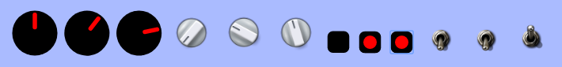

# input-knobs.js



---

[Demo Page](https://g200kg.github.io/input-knobs/)

## Features
input-knobs.js is a Javascript library for Rotating Knob / Toggle Switch / RadioButton style GUI widgets.
This is a sub-set of "[webaudio-controls](https://github.com/g200kg/webaudio-controls)" and simply replace the appearance of &lt;input/&gt; tags to rotating knobs or switches.

| Tag                                                 | Change to     |
|-----------------------------------------------------|---------------|
| &lt;input type="range" class="input-knob"/&gt;      | Rotating Knob |
| &lt;input type="checkbox" class="input-switch"/&gt; | Toggle Switch |
| &lt;input type="radio" class="input-switch"/&gt;    | Radio Button  |

 * Easy to use by place and load just one file `input-knobs.js`.
 * Compatible with Chrome / Firefox / Safari / Edge.
 * Lightweighted. No other libraries are required.
 * 'input' and 'change' events are fired same as normal input tags.
 * Work normal even under 'file:///' protocol.

## Usage
 * Place `input-knobs.js` to appropriate folder
 * Load `input-knobs.js` :
   ```
   <script src="input-knobs.js"></script>
   ```
 *  Add class 'input-knob' to your 'type=range' slider tag or 'input-switch' to 'type=checkbox' / 'type=radio' button tags
 * Some optional attributes (data-*) are available for customize

## Attributes

|Attribute|Description|
|---------|-----------|
|data-diameter = "nnn"|Set the diameter of the knob or switch in 'px'. In default, 64 for knobs and 32 for switches.|
|data-src = "Image URL"|Use external image for the knobs/switches.<br/><br/> For Knobs, the image should be single knob-image that pointing upward (12 O'clock),or a vertically stitched knob-images that represent rotation of the knob frame by frame.<br/><br/> For Switches, this image should be a vertically stitched Off state and On state image.<br/><br/> If no image is supplied, input-knobs uses knob/switch images embedded inside (black body and red indicator)|
|data-sprites = "nn"|For Knob only.<br/><br/> If you use stitched knob-image, this attribute should be the number of frames.<br/><br/> If this number is 2 or more, input-knobs uses frame switching procedure instead of image rotation.|

## License  
**input-knobs.js** is licensed under MIT-License.  
Knob/Switch images in samples are from [KnobGallery](https://www.g200kg.com/en/webknobman/gallery.php),
toggle switch image by az (c) 2011 CC-BY

---
