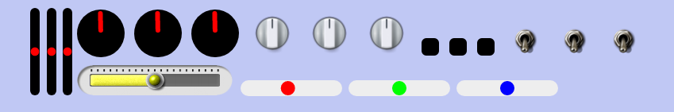

# input-knobs.js



---

## [input-knobs.js Sample Page](https://g200kg.github.io/input-knobs/)

---

## Features
input-knobs.js is a Javascript library for Rotating Knobs / Horizontal & Vertical Sliders / Toggle Switches / Radio Buttons style GUI widgets.
This is a sub-set of "[webaudio-controls](https://github.com/g200kg/webaudio-controls)" and simply replace the appearance of &lt;input/&gt; tags to rotating knobs, sliders or switches.

| Tag                                                 | Change to         |
|-----------------------------------------------------|-------------------|
| &lt;input type="range" class="input-knob"/&gt;      | Rotating Knob     |
| &lt;input type="range" class="input-slider"/&gt;   | Horizontal & Vertical Slider |
| &lt;input type="checkbox" class="input-switch"/&gt; | Toggle Switch     |
| &lt;input type="radio" class="input-switch"/&gt;    | Radio Button      |

 * Easy to use by place and load just one file `input-knobs.js`.
 * Compatible with Chrome / Firefox / Safari / Edge.
 * Lightweighted. No other libraries are required.
 * 'input' and 'change' events are fired same as normal input tags.
 * Work even under 'file:///' protocol.
 * Touch devices support.

## Usage
 * Place `input-knobs.js` to appropriate folder
 * Load `input-knobs.js` :
   ```
   <script src="input-knobs.js"></script>
   ```
 *  Add class 'input-knob', 'input-hslider', 'input-vslider' or 'input-switches' to input tags in your HTML
 * Some optional attributes (data-*) are available for customize

## Operation

There are some tips for knobs and sliders operation :

| Operation      | Description      |
|----------------|------------------|
| Mouse dragging | Upward / Right for increase value,<br/> Downward / Left for decrease value  |
| ShiftKey + dragging | Fine adjustment, 1/5 sensitivity to mouse movement |
| Mouse Wheel | Upward : increase value <br/> Downward : descrease value |
| ShiftKey + Mouse Wheel |  Fine adjustment, 1/5 sensitivity to mouse movement |
| Keyboard<br/>(after focused) | Up / Right arrow : increment value<br/>Down / Left arrow : decrement value |

## Attributes

|Attribute|Description|
|---------|-----------|
|data-diameter = "nnn"|Set the width and height of the knobs or switches in 'px'.This is equivarent to 'data-width="nnn" data-height="nnn"'. In default, 64 for knobs and 32 for switches.|
|data-width = "nnn"<br/>data-height = "nnn"|Set the width and height of the knobs, sliders or switches individually in 'px'.<br/>In default, 64 for knobs, 128 for sliders and 32 for switches.<br/>If the size for slider is vertically long, the slider will be a vertical slider.|
|data-src = "Image URL"|Use external image for the knobs/switches.<br/><br/>For Knobs, the image should be single knob-image that pointing upward (12 O'clock),      or a vertically stitched knob-images that represent rotation of the knob frame by frame.<br/><br/>For Sliders, the image should be a vertically stitched slider-images that represent thumb sliding from min value to max value frame by frame.<br/><br/>For Switches, this image should be a vertically stitched Off state and On state image.    <br/><br/>If no image is supplied, input-knobs uses knob/slider/switch images embedded inside (black body and red indicator)|
|data-sprites = "nnn"|For Knob / Sliders only. If you use frame stitched knob/slider-image, this attribute should be the <b>number of frames - 1</b>.<br/><br/>The knobs that specified 'data-src' but not specified this attribute, it will use image rotation instead of frame switching procedure.<br/><br/>The sliders that specified 'data-src' but not specified this attribute, the image is used as slider thumb part and the background is filled by 'data-bgcolor' .|
|data-fgcolor = "color"|Change Knob / Slider / Switch 's pointer color when no external image (data-src) is used. Default is red "#f00".|
|data-bgcolor = "color"|Change Knob / Slider / Switch 's background color when no external image (data-src) is used.Default is black "#000".|

## License  
**input-knobs.js** is released under the MIT License.  
Knob/Switch images in samples are from [KnobGallery](https://www.g200kg.com/en/webknobman/gallery.php),
toggle switch image by az (c) 2011 CC-BY

---
